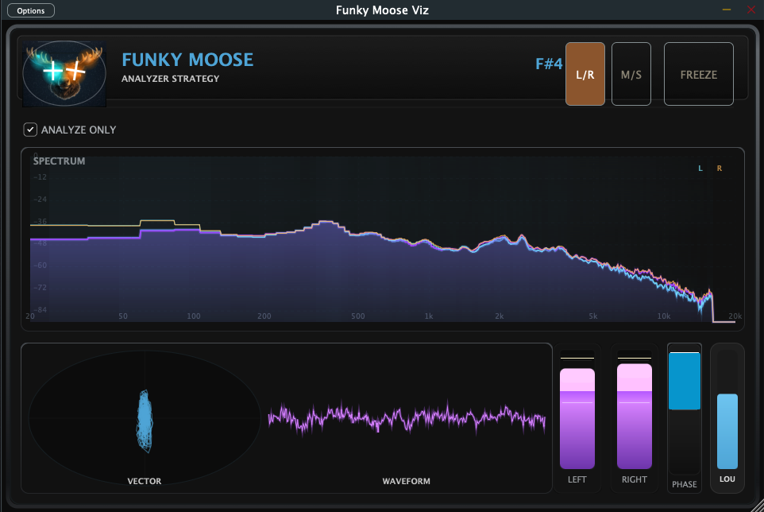

# 🫎 Funky Moose Viz

**Boutique-style audio visualizer for musicians, bass players and mix engineers.**

Funky Moose Viz is a JUCE-based audio visualization plugin combining spectrum analysis, waveform display, vectorscope and musical pitch detection in one cohesive interface.

It was designed to support musical understanding of sound, not just technical measurement.

Originally created to complement the Funky Moose Amp, but powerful enough to work as a standalone analysis tool.

---

### 🎛 Features
- **Real-time Spectrum Analyzer**
- **Waveform display**
- **Vector Scope** for stereo visualization
- **Musical Pitch Detection**
- **Vintage / boutique inspired UI**
- **Lightweight JUCE architecture**
- **Cross-platform builds**

**Supported plugin formats:**
- **AU** (macOS)
- **VST3** (macOS / Windows)
- **Standalone application**

---

### 🎯 Typical Use Cases

#### Bass Monitoring
Check fundamental frequencies, overtone balance and pitch stability.

#### Stereo Image Control
Visualize stereo width and phase coherence with the vectorscope.

#### Mix Bus Insight
Understand spectral balance and low-end behaviour at a glance.

#### Sound Design
Track harmonic movement and transient structure in real time.

---

### 🖥 Screenshot


---

### 🛠 Build From Source

**Requirements:**
- JUCE 8
- CMake
- Xcode (macOS) or Visual Studio (Windows)

**Example build:**
```bash
cmake -S . -B build -DCMAKE_BUILD_TYPE=Release
cmake --build build --config Release
```

---

### ⚠️ Notes
- Pitch detection works best with monophonic signals.
- GUI performance may vary on older systems.
- Further refinements are planned.

---

### 🚀 Roadmap
Future improvements may include:
- improved pitch detection stability
- refined spectrum visualization
- GUI performance optimizations
- additional user customization

---

### 🧠 Built With
- JUCE Framework
- Modern C++
- CMake build system

---

## 🇩🇪 Deutsch

### Funky Moose Viz
**Ein Boutique-Audio-Visualizer für Musiker, Bassisten und Mix-Engineers.**

Funky Moose Viz ist ein mit JUCE entwickeltes Audio-Plugin, das Spektrumanalyse, Wellenform-Anzeige, Vektorskop und musikalische Pitch-Erkennung in einer gemeinsamen Oberfläche kombiniert.

Das Ziel ist nicht nur Analyse, sondern ein besseres musikalisches Verständnis von Klang.

Ursprünglich als Ergänzung zum Funky Moose Amp entwickelt, funktioniert es ebenso als eigenständiges Visualisierungs-Tool.

---

### Funktionen
- Echtzeit Spektrumanalyse
- Wellenform-Anzeige
- Vektorskop zur Stereo-Visualisierung
- Pitch-Erkennung
- Vintage-inspirierte Benutzeroberfläche
- Schlanke JUCE-Architektur

**Unterstützte Formate:**
- AU (macOS)
- VST3 (macOS / Windows)
- Standalone-App

---

### Typische Anwendungen

#### Bass-Analyse
Grundton, Obertöne und Tonstabilität visuell kontrollieren.

#### Stereo-Kontrolle
Breite und Phase des Signals im Vektorskop überwachen.

#### Mix-Analyse
Spektrale Balance und Low-End-Verhalten verstehen.

#### Sounddesign
Harmonische Struktur und Transienten verfolgen.

---

### 🧠 Philosophie
> Klang wird nicht nur gehört. Er wird gesehen, gespürt und verstanden. Funky Moose Viz verbindet diese Ebenen.

---

### Lizenz
MIT License

---
*Copyright (c) 2026 blubass*
